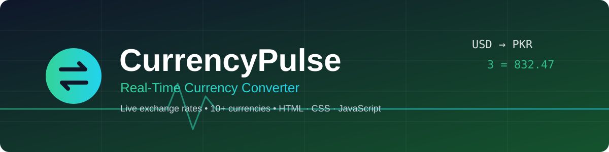
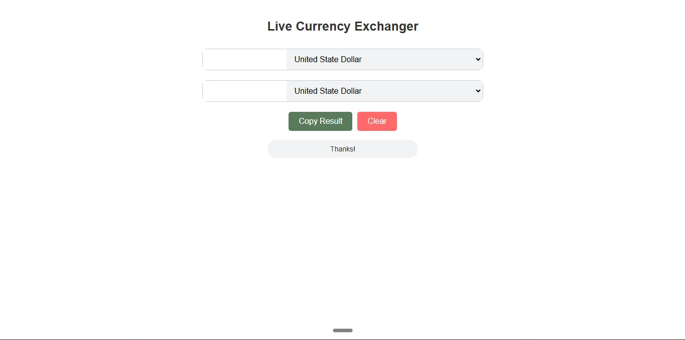
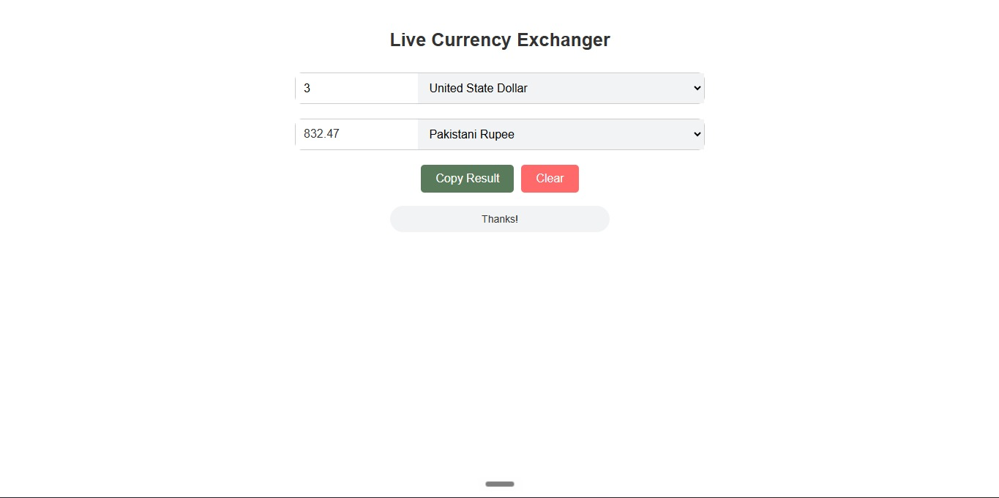
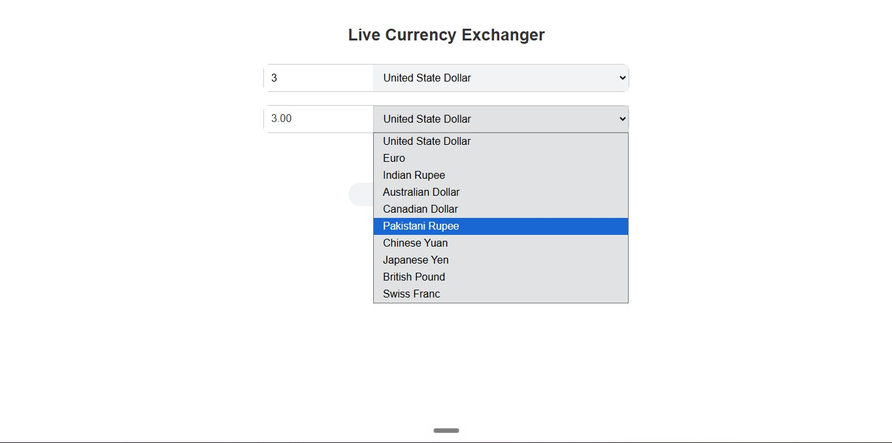
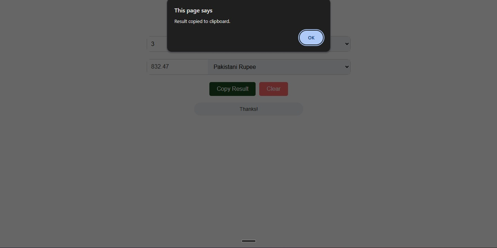

<!-- Banner: docs/banner.svg. Screenshots: docs/screenshots/ -->
<p align="center">
  
</p>

<h1 align="center">CurrencyPulse</h1>

<p align="center">
  A lightweight, front-end currency converter built with HTML, CSS and vanilla JavaScript.
  It fetches live exchange rates from a public REST API and converts amounts instantly as you type.
</p>

<p align="center">
  
  
  
  
  
</p>

### <u>Table of Contents</u>

- [About](#about)
- [Screenshots](#screenshots)
- [Features](#features)
- [How It Works](#how-it-works)
- [Supported Currencies](#supported-currencies)
- [Tech Stack](#tech-stack)
- [Getting Started](#getting-started)
- [Project Structure](#project-structure)
- [Known Limitations](#known-limitations)
- [Future Improvements](#future-improvements)
- [License](#license)
- [Author](#author)

---

### <u>About</u>

CurrencyPulse lets a user pick a source currency, a target currency and an amount, and
shows the converted value right away, with no "Convert" button needed. Rates come from the
[ExchangeRate-API](https://www.exchangerate-api.com/) `v4/latest` endpoint, so results
reflect current market rates. The project was built to practise asynchronous JavaScript,
API integration and DOM event handling.

### <u>Screenshots</u>

<p align="center">
  &nbsp;
  
</p>
<p align="center">
  &nbsp;
  
</p>

### <u>Features</u>

| Area | What it does |
|---|---|
| **Live conversion** | Fetches the latest rates for the selected source currency and calculates the result with `toFixed(2)` precision |
| **Instant updates** | Re-converts on every `input` and `change` event: typing an amount or switching either currency |
| **Input validation** | Empty, zero and negative amounts show an "Enter a valid amount." message instead of calling the API |
| **Copy Result** | Copies the converted value with the Clipboard API and confirms with an alert |
| **Clear** | Resets the amount, both currency selections and the result in one click |
| **Error handling** | Handles failed requests and missing rates with user-friendly alerts and console logging |

### <u>How It Works</u>

1. The user types an amount and selects the source and target currencies.
2. `getExchangeRate()` validates the amount, then calls
   `https://api.exchangerate-api.com/v4/latest/{fromCurrency}` using the Fetch API.
3. The JSON response is parsed and the rate for the target currency is read from `data.rates`.
4. The converted amount is calculated and displayed in the result field.
5. **Copy Result** uses `navigator.clipboard.writeText()`; **Clear** resets the form.

### <u>Supported Currencies</u>

| Code | Currency | Code | Currency |
|---|---|---|---|
| USD | United States Dollar | CNY | Chinese Yuan |
| EUR | Euro | JPY | Japanese Yen |
| INR | Indian Rupee | GBP | British Pound |
| AUD | Australian Dollar | CHF | Swiss Franc |
| CAD | Canadian Dollar | MXN | Mexican Peso |
| PKR | Pakistani Rupee | BRL | Brazilian Real |

### <u>Tech Stack</u>

| Layer | Technology |
|---|---|
| Markup | HTML5 |
| Styling | CSS3 (Flexbox, hover states) |
| Logic | JavaScript (ES6), Fetch API, Promises, Clipboard API |
| Data source | ExchangeRate-API (`v4/latest`) |
| Tooling | Git, GitHub, VS Code |

### <u>Getting Started</u>

**Requirements:** any modern browser and an internet connection (needed for live rates). No build step or dependencies.

```bash
# 1. Clone the repository
git clone https://github.com/<your-username>/CurrencyPulse.git

# 2. Open the project folder
cd CurrencyPulse

# 3. Open index.html in your browser
#    (or use the VS Code "Live Server" extension)
```

### <u>Project Structure</u>

```
.
├── index.html            # Page markup and currency dropdowns
├── assets/
│   ├── css/style.css     # Layout, buttons and hover styles
│   └── js/script.js      # API call, validation, copy and clear logic
├── docs/
│   ├── banner.svg        # README banner
│   └── screenshots/      # README screenshots
└── README.md
```

### <u>Known Limitations</u>

- Requires an internet connection; there is no offline fallback or rate caching.
- A request is sent on every keystroke, so very fast typing can trigger many API calls.
- Errors are shown with browser `alert()` dialogs rather than inline messages.
- The currency list is hard-coded in the HTML.

### <u>Future Improvements</u>

- Debounce input to reduce API calls
- Add a "swap currencies" button
- Show inline error messages instead of alerts
- Cache the latest rates for offline use
- Add more currencies and a searchable dropdown

### <u>License</u>

Released under the MIT License. See the [LICENSE](LICENSE) file.

### <u>Author</u>

**Muhammad Nabeel Ijaz**
